# The Happy Lab - Architecture Overview

## Infrastructure Stack

```mermaid
flowchart TB
    subgraph Internet["🌐 Internet"]
        Users["Users/Visitors"]
        Discord["Discord API"]
        GitHub["GitHub (Source)"]
    end

    subgraph Hetzner["🏢 Hetzner Cloud (46.225.124.37)"]
        subgraph Server["Ubuntu Server"]
            subgraph Docker["Docker Engine"]
                subgraph CoolifyNetwork["Coolify Network"]
                    Traefik["🔀 Traefik Reverse Proxy
                    (SSL/TLS + Routing)"]
                end
            end
        end
    end

    subgraph CoolifyServices["🛠️ Coolify Services"]
        direction TB
        CoolifyDashboard["📊 Coolify Dashboard
        guru.thehappylab.net"]
        Sentinel["📡 Sentinel Agent
        (Metrics/Monitoring)"]
    end

    subgraph Applications["📱 Applications"]
        direction TB
        Spesalina["🍽️ Spesalina
        spesalina.thehappylab.com
        (Meal Planning)"]
        AppTemplate["📋 App Template
        app-template.thehappylab.com
        (Next.js Starter)"]
        HappyLabWeb["🌐 The Happy Lab
        thehappylab.com
        (Main Website)"]
        CRACheck["✅ CRA-Check
        cra-check.thehappylab.com
        (EU Compliance)"]
    end

    subgraph ToolsServices["🔧 Tools & Services"]
        direction TB
        Umami["📈 Umami Analytics
        analytics.thehappylab.com"]
        Postgres[(🗄️ PostgreSQL
        Umami DB)]
        Dozzle["📜 Dozzle Logs
        logs.thehappylab.com"]
        Uptime["⏱️ Uptime Kuma
        uptime.thehappylab.com"]
        Vaultwarden["🔐 Vaultwarden
        pass.thehappylab.com
        (Password Manager)"]
    end

    subgraph OpenClawSystem["🤖 OpenClaw System"]
        direction TB
        OpenClawGW["🎯 OpenClaw Gateway
        openclaw-guru.thehappylab.com"]
        Browser["🌐 Browser Service
        (Chrome CDP)"]

        subgraph Agents["AI Agents"]
            Tony["🚀 Tony (Growth Agent)
        Discord: growth-bot"]
            Bob["🔨 Bob (Builder Agent)
        Discord: builder-bot"]
            Nici["⚙️ Nici (Operation Agent)
        Discord: operation-bot"]
        end

        subgraph Workspaces["Agent Workspaces"]
            WS_Tony["/workspace-growth"]
            WS_Bob["/workspace-build"]
            WS_Nici["/workspace-operation"]
        end
    end

    subgraph ExternalAPIs["🔗 External APIs"]
        OpenRouter["OpenRouter AI
        (Models: Kimi, Claude, GPT)"]
        OpenAI["OpenAI API
        (Images, TTS)"]
        BraveSearch["Brave Search API"]
        Bitwarden["Bitwarden Vault"]
    end

    %% Connections
    Users --> Traefik
    Traefik --> Spesalina
    Traefik --> AppTemplate
    Traefik --> HappyLabWeb
    Traefik --> CRACheck
    Traefik --> Umami
    Traefik --> Dozzle
    Traefik --> Uptime
    Traefik --> Vaultwarden
    Traefik --> OpenClawGW

    Umami --> Postgres

    OpenClawGW --> Browser
    OpenClawGW --> Tony
    OpenClawGW --> Bob
    OpenClawGW --> Nici

    Tony --> WS_Tony
    Bob --> WS_Bob
    Nici --> WS_Nici

    Tony --> Discord
    Bob --> Discord
    Nici --> Discord

    OpenClawGW --> OpenRouter
    OpenClawGW --> OpenAI
    OpenClawGW --> BraveSearch
    OpenClawGW --> Bitwarden

    OpenClawGW --> CoolifyDashboard
    OpenClawGW --> Umami

    GitHub --> CoolifyDashboard
    CoolifyDashboard --> Traefik
    Sentinel --> CoolifyDashboard

    style OpenClawSystem fill:#e1f5fe,stroke:#01579b,stroke-width:3px
    style Agents fill:#fff3e0,stroke:#e65100,stroke-width:2px
    style Applications fill:#e8f5e9,stroke:#2e7d32,stroke-width:2px
    style ToolsServices fill:#fce4ec,stroke:#c2185b,stroke-width:2px
    style Hetzner fill:#f3e5f5,stroke:#7b1fa2,stroke-width:2px
```



## Detailed Component Breakdown

### 🏢 Infrastructure Layer
| Component | Details |
|-----------|---------|
| **Cloud Provider** | Hetzner Cloud |
| **Server IP** | 46.225.124.37 |
| **Hetzner Server ID** | 120813007 |
| **OS** | Ubuntu (Linux 6.8.0-90-generic) |
| **Container Runtime** | Docker |
| **Reverse Proxy** | Traefik v3.6.8 |
| **SSL Certificates** | Let's Encrypt (auto) |

### 🛠️ Coolify PaaS
| Component | Details |
|-----------|---------|
| **Dashboard** | guru.thehappylab.net |
| **Version** | v4.0.0-beta.463 |
| **Servers** | 2 (coolify host + coolify-apps) |
| **Monitoring** | Sentinel Agent |

### 📱 Applications (Next.js + Docker)
| App | Domain | Description | Database |
|-----|--------|-------------|----------|
| **Spesalina** | spesalina.thehappylab.com | Meal planning app | SQLite |
| **App Template** | app-template.thehappylab.com | Next.js starter template | SQLite |
| **The Happy Lab** | thehappylab.com | Main company website | SQLite |
| **CRA-Check** | cra-check.thehappylab.com | EU Cyber Resilience Act tool | - |

### 🔧 Shared Services
| Service | Domain | Purpose |
|---------|--------|---------|
| **Umami** | analytics.thehappylab.com | Privacy-focused analytics |
| **PostgreSQL** | (internal) | Database for Umami |
| **Dozzle** | logs.thehappylab.com | Docker log viewer |
| **Uptime Kuma** | uptime.thehappylab.com | Uptime monitoring |
| **Vaultwarden** | pass.thehappylab.com | Password manager (Bitwarden RS) |

### 🤖 OpenClaw AI Platform
| Component | Details |
|-----------|---------|
| **Gateway** | openclaw-guru.thehappylab.com |
| **Container** | ghcr.io/thehappylab/openclaw:2026.2.17-12 |
| **Browser Service** | Chrome CDP at browser:9223 |
| **Data Volume** | /data/.openclaw |

#### AI Agents
| Agent | Name | Discord Bot | Workspace | Purpose |
|-------|------|-------------|-----------|---------|
| **growth** | Tony | growth-bot | /workspace-growth | Growth & marketing |
| **builder** | Bob | builder-bot | /workspace-build | Product development |
| **operation** | Nici | operation-bot | /workspace-operation | Operations & infra |

#### AI Model Stack
| Provider | Models | Use Case |
|----------|--------|----------|
| **OpenRouter** | Kimi K2.5 (default), Claude Opus 4.6, GPT-5.2 Codex | LLM inference |
| **OpenAI** | GPT-4, DALL-E, Whisper | Images, TTS, audio |
| **Brave** | Web Search API | Search capabilities |

#### Tool Integrations
| Tool | Purpose |
|------|---------|
| **Bitwarden CLI** | Secret management |
| **GitHub CLI** | Repository operations |
| **Coolify API** | Deployment management |
| **Umami API** | Analytics access |
| **Browser Control** | Web automation (Chrome) |

### 🔐 Security & Auth
| Component | Setup |
|-----------|-------|
| **Basic Auth** | Enabled on OpenClaw Gateway |
| **Discord Auth** | Bot tokens (3 separate bots) |
| **Secrets** | Bitwarden vault |
| **Group Policy** | Open (trusted Discord) |

### 📊 Data Flow

```
User Request
     ↓
Traefik (SSL termination + routing)
     ↓
Application/Service
     ↓
[If OpenClaw] → AI Agent → External APIs
     ↓
Response
```

### 🔄 CI/CD Flow

```
GitHub Push
     ↓
Coolify Webhook
     ↓
Docker Build
     ↓
Container Deploy
     ↓
Traefik Route Update
```

---

*Diagram generated: 2026-02-17*
*Last updated: OpenClaw v2026.2.17*
